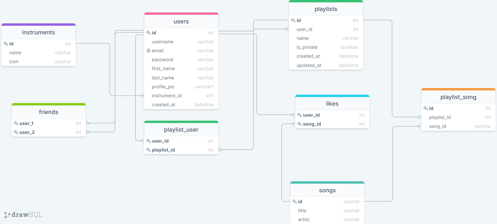

#Tabular
---

### Project Proposal 

##Overview

Tabular is an application for searching, organizing, and sharing guitar, bass and drum tabs. This website will make use of the popular guitar tabs website Songsterr and expand upon it, adding additional functionality. 

##Goal

The goal of this site is to make it easier for individuals (or groups such as bands) that want to learn how to play songs on the guitar or drums to access the tabs for the songs in a collaborative space. 

##Target Demographic

This site is primarily targeted towards members of amateur band members that want to organize their setlists and share tabs with each other in a central location. However, Tabify might also be useful for any individual that would like to learn new music. This would allow them to create “wishlists” of songs to learn, as well as organize the songs that they can already play for reference, to name a few possible use cases.

##Data

I will be using the [Songsterr search API](https://www.songsterr.com/a/wa/api) to get links to the Songsterr tabs for user selected songs. A stretch goal is to allow a user to import their Spotify playlists, in which case I would also be using the [Spotify Web API](https://developer.spotify.com/documentation/web-api/quick-start/).

##App Functionality

In Songsterr, you only have the option to Favorite songs and create playlists. Tabify will allow you to connect with other users, share your playlists with friends, and categorize your songs based on how much you have practiced them (ex. Mastered, needs work, no experience). Users will also be able to private message each other and collaborate on playlists.

##Rough Database Schema

This is the rough first draft of my database schema, which represents the basic Tabular functionality. This will be expanded upon later to encompass any stretch goals that I am able to implement.

##Potential Data Limitations

1. Songsterr has a very limited collection of song tabs. If I were to integrate Spotify, many songs would not be available.
2. The user will be redirected out of the app to access tabs.
3. The Songsterr API only provides the song title and artist name (may use Spotify API to get more info?)

##Sensitive Information

I will need to secure user emails and passwords, as well as private playlists.

##Additional Features/Stretch Goals

I plan to add functionality where users can choose whether their playlist is private or public, and allow them to choose individual users to share private playlists with. I will also have a “friends” feature that will allow users to add other users as friends. I have several stretch goals. Ideally, I would like to add the functionality for creating groups (bands) which users can be invited to (or kicked from). Playlists could be designated as group-specific. More potential here: users receive notifications when group playlists are changed, add calendar feature for bands to schedule events (and assign playlists to events), add group messaging feature. Another stretch goal is to implement the Spotify API and allow users to import their Spotify playlists, filtered for songs which have tabs available. 